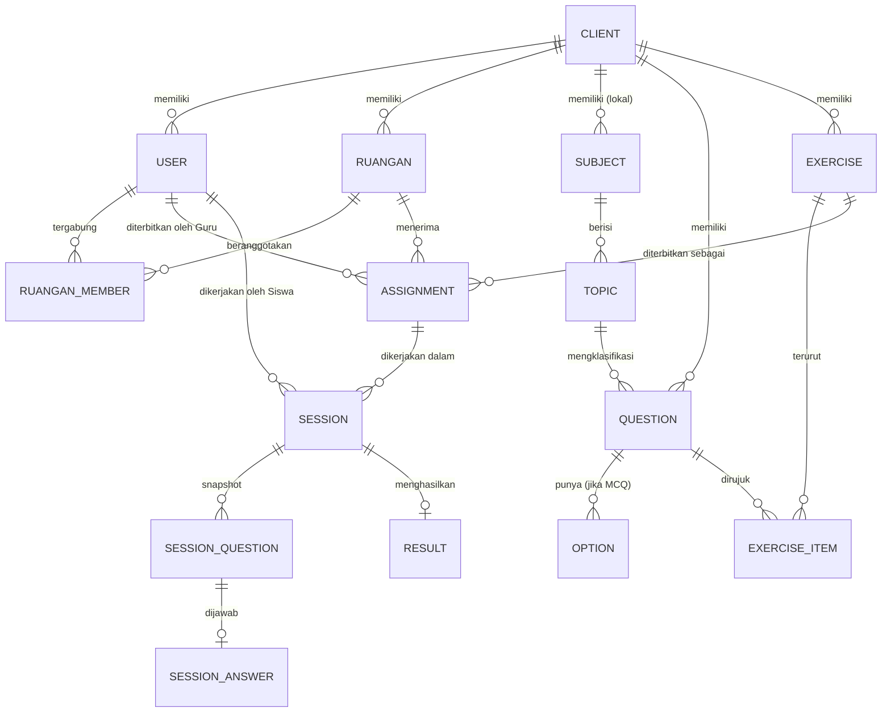
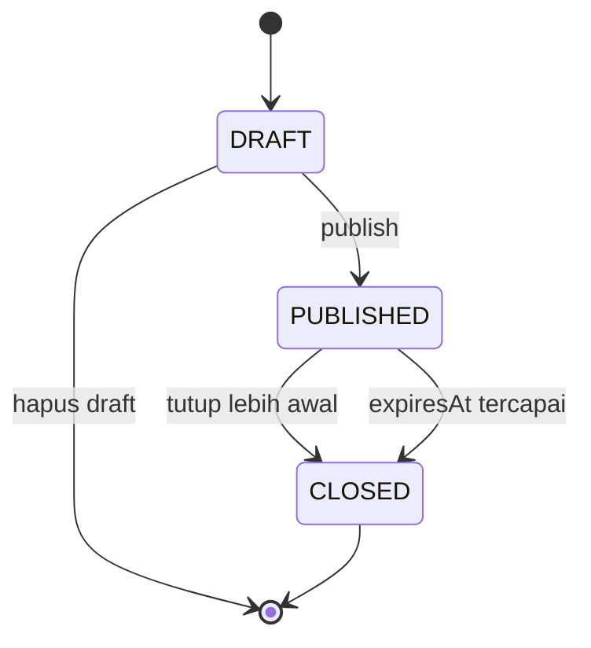
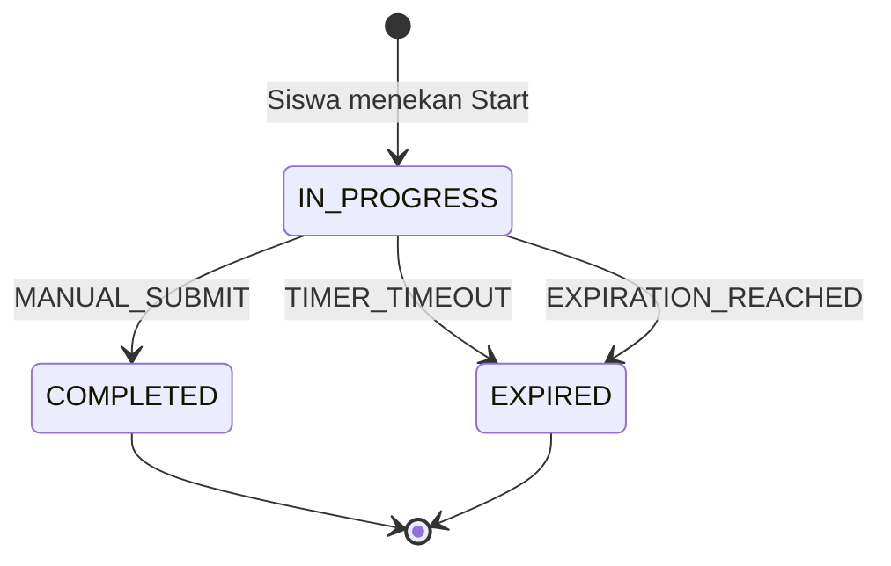
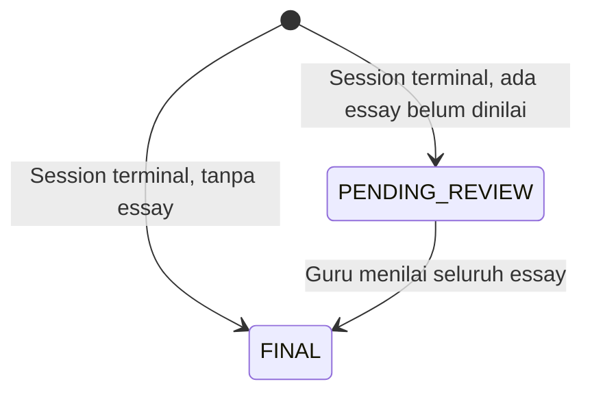

# Spesifikasi Eduscreen v1

Status: siap dieksekusi
Bahasa domain: `CONTEXT.md` di root repo
Konstitusi teknis: `CONSTITUTION.md` di root repo
Keputusan arsitektural: `docs/adr/0001` – `0016`

Dokumen ini mendefinisikan **perilaku** dan **model data konseptual**: apa yang harus terjadi, bukan dengan teknologi apa. Pilihan teknologi dan aturan penulisan kode berada di `CONSTITUTION.md`.

Pembagian tugas antar dokumen:

| Dokumen | Menjawab |
| --- | --- |
| `CONTEXT.md` | istilah apa yang kita pakai |
| `.scratch/eduscreen/spec.md` | apa yang harus terjadi (`BR-*`, `AC-*`) |
| `CONSTITUTION.md` | bagaimana bentuk kodenya (`TC-*`) |
| `docs/adr/` | mengapa masing-masing dipilih |

---

## 1. Visi & Sasaran

### Masalah

Guru di sekolah dan lembaga bimbingan belajar menghabiskan waktu tidak proporsional untuk menggandakan, membagikan, mengumpulkan, dan memeriksa soal latihan. Siswa mengerjakan lembar kertas yang hasilnya baru kembali beberapa hari kemudian, saat konteks belajarnya sudah hilang.

### Solusi

Eduscreen memisahkan tiga pekerjaan yang selama ini menyatu: **menyusun soal**, **mendistribusikannya**, dan **memeriksanya**. Eduscreen menyediakan konten master siap pakai sehingga Client tidak memulai dari nol. Guru meracik Exercise dari Question Bank lalu menerbitkannya sebagai Assignment ke Ruangan dengan satu tindakan. Siswa mengerjakannya di portal, dan pemeriksaan pilihan ganda terjadi seketika.

### Ukuran keberhasilan v1

| Ukuran | Target |
| --- | --- |
| Waktu Guru dari "punya materi" sampai "soal sampai ke siswa" | di bawah 10 menit |
| Client baru punya bank soal terisi di hari pertama | ya, lewat onboarding |
| Siswa bisa melanjutkan pengerjaan setelah browser tertutup | selalu, tanpa kehilangan jawaban |
| Guru mendapat rekap nilai satu Ruangan | seketika, tanpa memeriksa manual untuk soal pilihan ganda |

### Bukan tujuan v1

Menggantikan LMS, mengelola presensi, menyimpan materi ajar, menilai sikap, atau menerbitkan rapor.

---

## 2. Aktor & Peran

### Organization role

| Peran | Keterangan |
| --- | --- |
| **Eduscreen** | Pemilik platform. Mengelola Subject global, konten master, dan onboarding Client. |
| **Client** | Sekolah atau lembaga bimbingan belajar yang berlangganan. Satu Client = satu tenant dengan data terisolasi penuh. |

### Functional role

| Peran | Lingkup | Tanggung jawab utama |
| --- | --- | --- |
| **Eduscreen Admin** | seluruh platform | Subject global, Question & Exercise master, onboarding Client |
| **Client Admin** | satu Client | Ruangan, akun Guru & Siswa, Question Bank internal, adopsi konten master |
| **Guru** | Ruangan yang ditugaskan padanya | menulis Question, meracik Exercise, menerbitkan Assignment, menilai essay, membaca laporan |
| **Siswa** | Ruangan tempat ia terdaftar | mengerjakan Assignment, melihat Result miliknya |

### Matriks izin

Legenda: **C** buat · **R** baca · **U** ubah · **D** soft delete · **—** tidak ada akses

| Objek | Eduscreen Admin | Client Admin | Guru | Siswa |
| --- | --- | --- | --- | --- |
| Client | C R U | R (miliknya) | — | — |
| Subject global | C R U D | R | R | — |
| Subject lokal Client | R | C R U D | R | — |
| Topic global | C R U D | R | R | — |
| Topic lokal Client | R | C R U D | C R U D | — |
| Question master | C R U D | R (katalog adopsi) | — | — |
| Exercise master | C R U D | R (katalog adopsi) | — | — |
| Question Client | — | C R U D | C R U D | R (hanya lewat Session) |
| Exercise Client | — | C R U D | C R U D | — |
| Ruangan | — | C R U D | R (yang ditugaskan) | R (keanggotaannya) |
| Akun Guru & Siswa | — | C R U D | R (anggota Ruangannya) | R (dirinya) |
| Assignment | — | R | C R U (Ruangannya) | R (aktif di Ruangannya) |
| Session | — | R | R (Ruangannya) | C R U (miliknya) |
| Result | — | R | R U (penilaian essay) | R (miliknya) |

Catatan izin yang tidak jelas dari tabel:

- **BR-P01** — Guru hanya bisa menerbitkan Assignment ke Ruangan tempat ia ditugaskan.
- **BR-P02** — Question dan Exercise milik Client terlihat oleh seluruh Guru di Client itu, tanpa memandang siapa pembuatnya. Tidak ada konten privat per Guru.
- **BR-P03** — Siswa tidak pernah bisa membaca Question langsung; ia hanya melihat Question lewat SessionQuestion di dalam Session miliknya.
- **BR-P04** — Tidak ada peran yang bisa membaca data Client lain. Isolasi tenant absolut, dengan satu pengecualian yang diatur BR-P05.
- **BR-P05** — Client Admin dapat menyalakan **akses dukungan**: jendela **baca-saja** bagi Eduscreen Admin atas data Client-nya, padam otomatis setelah beberapa jam, dengan setiap pembacaan tercatat di audit yang bisa ditunjukkan kepada Client. Eduscreen Admin tidak pernah bisa mengubah data Client, bahkan selama jendela itu terbuka. Tanpa persetujuan Client Admin, tanda `—` pada matriks di atas berlaku penuh (ADR-0015).

---

## 3. Glosarium

Bahasa domain proyek ini tunggal dan tinggal di **`CONTEXT.md`** di root repo. Dokumen ini tidak menduplikasinya.

Setiap istilah bermodal awal kapital dalam spesifikasi ini (Subject, Topic, Question, Option, Exercise, Ruangan, Assignment, Quiz, Practice, Session, Snapshot, SessionQuestion, SessionAnswer, Attempt, Result) merujuk pada definisi di `CONTEXT.md`, bukan pada makna umumnya.

---

## 4. Model Data Konseptual

### 4.1 Diagram



### 4.2 Entitas

#### Client

Tenant. Akar isolasi data.

| Atribut | Keterangan |
| --- | --- |
| `name` | nama sekolah atau lembaga |
| `timezone` | satu zona: `Asia/Jakarta`, `Asia/Makassar`, atau `Asia/Jayapura` |
| `status` | `ACTIVE` \| `SUSPENDED` |

#### User

Satu tabel untuk semua peran. Eduscreen Admin adalah satu-satunya `User` tanpa `clientId`.

| Atribut | Keterangan |
| --- | --- |
| `email` | identitas login, unik global (ADR-0005) |
| `role` | `EDUSCREEN_ADMIN` \| `CLIENT_ADMIN` \| `GURU` \| `SISWA` |
| `clientId` | null hanya untuk `EDUSCREEN_ADMIN` |
| `status` | `INVITED` \| `ACTIVE` \| `DEACTIVATED` |

#### Subject

| Atribut | Keterangan |
| --- | --- |
| `name` | memuat jenjang: `Matematika Kelas 4` (ADR-0004) |
| `origin` | `GLOBAL` \| `CLIENT` |
| `clientId` | null bila `origin = GLOBAL` |
| `deletedAt` | soft delete |

#### Topic

| Atribut | Keterangan |
| --- | --- |
| `subjectId` | induk |
| `name` | `Aljabar Dasar` |
| `origin` | `GLOBAL` \| `CLIENT` |
| `clientId` | null bila `origin = GLOBAL`. Boleh berisi meski Subject induknya `GLOBAL`. |
| `deletedAt` | soft delete |

#### Question

| Atribut | Keterangan |
| --- | --- |
| `topicId` | tepat satu Topic |
| `type` | `MULTIPLE_CHOICE` \| `ESSAY` |
| `body` | rich content: teks berformat, gambar, notasi matematika |
| `explanation` | pembahasan; wajib untuk Question yang dipakai Practice |
| `owner` | `EDUSCREEN` \| `CLIENT` |
| `clientId` | null bila `owner = EDUSCREEN` |
| `sourceQuestionId` | jejak adopsi, tidak dipakai untuk sinkronisasi (ADR-0001) |
| `createdBy` | User pembuat |
| `deletedAt` | soft delete, tidak pernah hapus keras |

#### Option

Hanya untuk Question `MULTIPLE_CHOICE`.

| Atribut | Keterangan |
| --- | --- |
| `questionId` | induk |
| `body` | rich content |
| `isCorrect` | tepat satu bernilai benar per Question |
| `position` | urutan asli sebelum pengacakan |

#### Exercise

| Atribut | Keterangan |
| --- | --- |
| `title` | nama paket |
| `owner` | `EDUSCREEN` \| `CLIENT` |
| `clientId` | null bila `owner = EDUSCREEN` |
| `createdBy` | User pembuat |
| `lockedAt` | terisi saat Assignment pertamanya dibuat; setelah itu read-only |
| `deletedAt` | soft delete |

Exercise **tidak** punya `subjectId` atau `topicId` — isinya boleh lintas Subject dan Topic.

#### ExerciseItem

| Atribut | Keterangan |
| --- | --- |
| `exerciseId`, `questionId` | pasangan |
| `position` | urutan asli yang disusun Guru |

#### Ruangan

| Atribut | Keterangan |
| --- | --- |
| `clientId` | pemilik |
| `name` | `Kelas 4B 2026/2027`, `Bimbel Intensif SBMPTN Group B` |
| `status` | `ACTIVE` \| `ARCHIVED` |

#### RuanganMember

Relasi many-to-many untuk Guru maupun Siswa.

| Atribut | Keterangan |
| --- | --- |
| `ruanganId`, `userId` | pasangan |
| `memberRole` | `GURU` \| `SISWA` |

#### Assignment

| Atribut | Keterangan |
| --- | --- |
| `exerciseId` | isi soal |
| `ruanganId` | tepat satu Ruangan |
| `publishedBy` | Guru penerbit |
| `mode` | `QUIZ` \| `PRACTICE` (ADR-0003) |
| `status` | `DRAFT` \| `PUBLISHED` \| `CLOSED` |
| `timerDurationMinutes` | wajib untuk `QUIZ`, opsional untuk `PRACTICE` |
| `expiresAt` | wajib untuk kedua mode, disimpan UTC |
| `maxAttempts` | bilangan untuk `QUIZ`; diabaikan untuk `PRACTICE` (tak terbatas) |
| `shuffleQuestions` | boolean |
| `shuffleOptions` | boolean |
| `revealAnswersAt` | `AFTER_SUBMIT` \| `AFTER_EXPIRATION`; hanya berlaku untuk `QUIZ` |
| `publishedAt` | waktu publish |

#### Session

| Atribut | Keterangan |
| --- | --- |
| `assignmentId`, `studentId` | pasangan |
| `attemptNumber` | 1, 2, 3, … per pasangan di atas |
| `status` | `IN_PROGRESS` \| `COMPLETED` \| `EXPIRED` |
| `startedAt` | waktu server saat Siswa menekan Start |
| `effectiveDeadline` | dihitung dan **dibekukan** saat Session lahir (§8.2) |
| `finalizedAt` | waktu finalisasi |
| `terminalReason` | `MANUAL_SUBMIT` \| `TIMER_TIMEOUT` \| `EXPIRATION_REACHED` |

#### SessionQuestion

Snapshot. Tidak pernah berubah setelah dibuat.

| Atribut | Keterangan |
| --- | --- |
| `sessionId`, `questionId` | pasangan |
| `position` | urutan hasil pengacakan untuk Session ini |
| `optionOrder` | urutan Option hasil pengacakan untuk Session ini |
| `lockedAt` | terisi untuk Practice saat jawaban dikirim |

#### SessionAnswer

| Atribut | Keterangan |
| --- | --- |
| `sessionQuestionId` | induk |
| `selectedOptionId` | untuk MCQ |
| `essayText` | untuk essay |
| `isCorrect` | dihitung untuk MCQ saat dikirim; null untuk essay |
| `essayScore` | 0–100, diisi Guru; null sampai dinilai |
| `answeredAt` | waktu server |

#### Result

| Atribut | Keterangan |
| --- | --- |
| `sessionId` | satu Result per Session |
| `status` | `PENDING_REVIEW` \| `FINAL` |
| `kind` | `GRADED` (dari Quiz) \| `PRACTICE` |
| `totalQuestions`, `correctCount`, `incorrectCount`, `unansweredCount` | rekap |
| `score` | poin didapat ÷ poin total, disimpan sebagai angka hasil hitung (ADR-0002) |

---

## 5. State Machine

### 5.1 Assignment



| Dari | Ke | Pemicu | Aktor |
| --- | --- | --- | --- |
| — | `DRAFT` | Guru membuat Assignment | Guru |
| `DRAFT` | `PUBLISHED` | Guru menekan Publish | Guru |
| `DRAFT` | dihapus | Guru membuang draft | Guru |
| `PUBLISHED` | `CLOSED` | Guru menutup lebih awal | Guru |
| `PUBLISHED` | `CLOSED` | `expiresAt` terlewati | sistem, saat diakses |

- **BR-A01** — Di `DRAFT` seluruh atribut bebas diubah.
- **BR-A02** — Di `PUBLISHED` hanya `expiresAt` yang boleh diubah, dan hanya **diperpanjang**. Memajukannya ditolak.
- **BR-A03** — `timerDurationMinutes`, `mode`, `exerciseId`, `shuffleQuestions`, `shuffleOptions`, dan `maxAttempts` terkunci setelah publish.
- **BR-A04** — Assignment `PUBLISHED` atau `CLOSED` tidak bisa dihapus. Hanya draft yang bisa.
- **BR-A05** — Menutup lebih awal memfinalisasi seluruh Session `IN_PROGRESS` di Assignment itu dengan `terminalReason = EXPIRATION_REACHED`.

### 5.2 Session



| Dari | Ke | Pemicu | Aktor |
| --- | --- | --- | --- |
| — | `IN_PROGRESS` | Siswa menekan Start; Snapshot dibuat | Siswa |
| `IN_PROGRESS` | `COMPLETED` | Siswa menekan Selesai sebelum deadline | Siswa |
| `IN_PROGRESS` | `EXPIRED` | `now > effectiveDeadline`, sebab Timer | sistem, saat diakses |
| `IN_PROGRESS` | `EXPIRED` | `now > effectiveDeadline`, sebab `expiresAt` | sistem, saat diakses |

`COMPLETED` dan `EXPIRED` adalah terminal. Tidak ada transisi keluar — termasuk saat Guru memperpanjang `expiresAt` (BR-T06).

### 5.3 Result



| Dari | Ke | Pemicu | Aktor |
| --- | --- | --- | --- |
| — | `PENDING_REVIEW` | finalisasi Session yang memuat SessionAnswer essay | sistem |
| — | `FINAL` | finalisasi Session tanpa essay sama sekali | sistem |
| `PENDING_REVIEW` | `FINAL` | essay terakhir dinilai Guru | Guru |

- **BR-R01** — Result `PRACTICE` selalu langsung `FINAL`; Practice tidak boleh memuat essay (BR-M04).
- **BR-R02** — Skor Result `PENDING_REVIEW` menampilkan porsi MCQ saja dan ditandai sementara.

---

## 6. Alur Fungsional

### 6.1 Eduscreen Admin — onboarding Client

1. Isi nama Client dan `timezone`.
2. Isi email Client Admin pertama; sistem mengirim undangan.
3. Pilih Subject dan Exercise master yang disalin ke Client.
4. Sistem melakukan copy-on-adopt (ADR-0001): Question beserta Option, Exercise beserta ExerciseItem, dan Topic yang dibutuhkan disalin ke `clientId` baru.
5. Client berstatus `ACTIVE` dengan bank soal terisi.

- **BR-O01** — Onboarding tidak membuat Ruangan maupun akun Siswa. Itu pekerjaan Client Admin.
- **BR-O02** — Subject `GLOBAL` tidak disalin; ia dibaca langsung oleh semua Client. Yang disalin adalah Topic, Question, dan Exercise.

### 6.2 Eduscreen Admin — konten master

Mengelola Subject `GLOBAL`, Topic `GLOBAL`, Question `owner = EDUSCREEN`, dan Exercise `owner = EDUSCREEN`. Perubahan di sini tidak pernah merambat ke Client yang sudah mengadopsi (ADR-0001).

### 6.3 Client Admin — Ruangan dan akun

1. Buat Ruangan dengan nama yang memuat periode (`Kelas 4B 2026/2027`).
2. Buat akun Guru dan Siswa satu per satu atau lewat impor.
3. Tugaskan Guru dan Siswa ke satu atau lebih Ruangan.
4. Di akhir tahun ajaran, arsipkan Ruangan dan buat yang baru.

- **BR-U01** — Satu Siswa boleh menjadi anggota banyak Ruangan; satu Ruangan boleh punya banyak Guru.
- **BR-U02** — Ruangan `ARCHIVED` bersifat read-only: tidak menerima Assignment baru, tidak menerima anggota baru, Session baru tidak bisa dimulai. Riwayat Result tetap terbaca.
- **BR-U03** — Menonaktifkan akun Siswa tidak menghapus Session dan Result miliknya.
- **BR-U04** — Email **transaksional** termasuk lingkup v1: undangan akun dan reset password. Tanpanya setiap password lupa menjadi tiket ke Client Admin. Email **pemberitahuan** (tugas baru terbit, pengingat deadline) tetap di luar v1 — lihat §12.

### 6.4 Client Admin & Guru — Question Bank

Keduanya boleh menulis Topic dan Question di lingkup Client. Tiga jalur pengisian:

1. **Adopsi katalog Eduscreen** — pilih Question atau Exercise master, sistem menyalinnya (ADR-0001).
2. **Editor manual** — rich text, gambar, dan notasi matematika di batang soal maupun tiap Option.
3. **Impor Excel/CSV** — hanya soal berbasis teks. Alurnya: unggah berkas → pratinjau hasil parsing → laporan baris gagal beserta alasannya → simpan hanya baris yang valid.

- **BR-Q01** — Question `MULTIPLE_CHOICE` wajib punya minimal 2 Option dan tepat 1 Option benar.
- **BR-Q02** — Question wajib melekat pada tepat satu Topic.
- **BR-Q03** — Question yang akan dipakai Practice wajib punya `explanation`; divalidasi saat publish, bukan saat penulisan.
- **BR-Q04** — Penghapusan Question dan Exercise selalu soft delete. Konten yang dihapus hilang dari pencarian bank soal tetapi tetap utuh di Exercise, Assignment, dan Session yang sudah memakainya.
- **BR-Q05** — Impor menolak seluruh berkas hanya bila formatnya tidak terbaca; kegagalan per baris tidak membatalkan baris lain.
- **BR-Q06** — Satu berkas impor memuat maksimum **500 baris**. Berkas yang lebih besar ditolak sebelum diproses, disertai pesan yang meminta pengguna memecahnya. Batas ini menjaga impor tetap berjalan sinkron tanpa infrastruktur pekerjaan latar (ADR-0014).

### 6.5 Guru — meracik Exercise

1. Buat Exercise, beri judul.
2. Telusuri bank soal Client. Filter berdasarkan Subject dan Topic, dan **boleh berpindah Subject maupun Topic dalam satu sesi perakitan**.
3. Tambahkan Question ke Exercise; atur urutannya.
4. Simpan.

- **BR-E01** — Exercise boleh memuat Question dari Subject dan Topic mana pun di dalam Client.
- **BR-E02** — Exercise terlihat dan bisa diduplikasi oleh seluruh Guru di Client yang sama.
- **BR-E03** — Exercise wajib memuat minimal 1 Question untuk bisa diterbitkan.
- **BR-E04** — Begitu Assignment pertamanya dibuat, `lockedAt` terisi dan Exercise menjadi read-only. Untuk mengubahnya, Guru menduplikasinya menjadi Exercise baru.

### 6.6 Guru — menerbitkan Assignment

1. Pilih Exercise dan Ruangan tujuan.
2. Pilih `mode`: `QUIZ` atau `PRACTICE`.
3. Isi aturan waktu, `maxAttempts`, dua sakelar pengacakan, dan `revealAnswersAt`.
4. Publish.

- **BR-M01** — Guru hanya bisa memilih Ruangan tempat ia ditugaskan dan yang berstatus `ACTIVE`.
- **BR-M02** — Satu Assignment menyasar tepat satu Ruangan. Menerbitkan ke tiga Ruangan menghasilkan tiga Assignment; UI boleh menyediakan tindakan borongan, tetapi entitasnya tetap tiga.
- **BR-M03** — `QUIZ` wajib mengisi `timerDurationMinutes`. `PRACTICE` boleh mengosongkannya.
- **BR-M04** — Publish sebagai `PRACTICE` **ditolak** bila Exercise memuat Question bertipe `ESSAY`, atau ada Question tanpa `explanation`. Pesan galat menyebutkan Question mana yang menyebabkannya.
- **BR-M05** — `expiresAt` wajib di kedua mode dan harus berada di masa depan saat publish.
- **BR-M06** — `maxAttempts` minimal 1 untuk `QUIZ`. Untuk `PRACTICE` nilainya diabaikan; Attempt tidak terbatas.
- **BR-M07** — Publish mengunci Exercise (BR-E04).

### 6.7 Siswa — dashboard dan pengerjaan

Dashboard menampilkan dua bagian: **Assignment aktif** dari seluruh Ruangan yang diikuti, dan **riwayat Result** miliknya sendiri.

Alur pengerjaan:

1. Siswa membuka Assignment dan menekan **Mulai Exercise**.
2. Sistem membuat Session, menghitung `effectiveDeadline`, mengacak, dan membekukan Snapshot.
3. Siswa menjawab; tiap jawaban terkirim otomatis ke server.
4. Session berakhir lewat salah satu dari tiga terminal condition (§8.3).

Perbedaan perilaku per mode:

| | `QUIZ` | `PRACTICE` |
| --- | --- | --- |
| Navigasi | bebas ke soal mana pun, ada peta soal | maju satu arah |
| Ubah jawaban | boleh sampai Selesai | tidak; terkunci saat dikirim |
| Feedback | sesuai `revealAnswersAt` | benar/salah + `explanation` seketika |
| Selesai | tombol Selesai | otomatis setelah soal terakhir, atau tombol Selesai |

- **BR-S01** — Session lahir **hanya** saat Siswa menekan Start. Tidak ada pembuatan massal (lazy instantiation).
- **BR-S02** — Snapshot dibekukan saat Session lahir dan tidak pernah berubah, termasuk ketika Siswa kembali setelah terputus.
- **BR-S03** — Dua Siswa pada Assignment yang sama mendapat urutan Question berbeda bila `shuffleQuestions` menyala.
- **BR-S04** — Tiap Attempt adalah Session baru dengan Snapshot baru.
- **BR-S05** — Siswa hanya bisa memulai Attempt baru bila Session sebelumnya sudah terminal dan `attemptNumber < maxAttempts` (Quiz) atau selalu (Practice).
- **BR-S06** — Membuka kembali Assignment yang Session-nya masih `IN_PROGRESS` mengembalikan Siswa ke Session itu, bukan membuat yang baru.
- **BR-S07** — Pada `PRACTICE`, SessionAnswer yang sudah dikirim tidak bisa diubah; `lockedAt` terisi dan `explanation` terbuka.
- **BR-S08** — Pengerjaan membutuhkan koneksi (ADR-0006). Jawaban dikirim segera dengan antrean coba-ulang; kegagalan berkepanjangan ditampilkan sebagai indikator koneksi, bukan disimpan lokal.

### 6.8 Guru — menilai essay

1. Buka daftar Result berstatus `PENDING_REVIEW` untuk satu Assignment.
2. Baca `essayText` tiap SessionAnswer, beri `essayScore` 0–100.
3. Saat essay terakhir di satu Session dinilai, Result-nya dihitung ulang dan berubah menjadi `FINAL`.

- **BR-G01** — Hanya Guru yang ditugaskan di Ruangan Assignment itu yang bisa menilai.
- **BR-G02** — `essayScore` boleh diubah selama Result belum dipakai di luar sistem; setiap perubahan memicu perhitungan ulang Result.
- **BR-G03** — Setiap perubahan `essayScore` dan setiap perhitungan ulang Result meninggalkan jejak audit permanen: siapa yang mengubah, kapan, dari nilai berapa ke berapa. Jejak ini tidak pernah diubah atau dihapus, dan bisa ditampilkan saat nilai dipersengketakan.

### 6.9 Guru — laporan

Laporan satu Assignment menampilkan **seluruh Siswa anggota Ruangan**, bukan hanya yang mengerjakan.

| Kolom | Isi |
| --- | --- |
| Siswa | nama |
| Status | `NOT_STARTED` \| `IN_PROGRESS` \| `COMPLETED` \| `EXPIRED` |
| Attempt | jumlah Session |
| Skor resmi | skor tertinggi di antara Result-nya; 0 bila `NOT_STARTED` |
| Penilaian | `FINAL` atau `PENDING_REVIEW` |

- **BR-L01** — Laporan dibangun dari daftar anggota Ruangan, bukan dari daftar Session. Siswa tanpa Session tampil `NOT_STARTED` dengan skor 0 **tanpa** membuat baris Session (BR-S01 tetap utuh).
- **BR-L02** — Membuka laporan memicu finalisasi seluruh Session Assignment itu yang sudah lewat `effectiveDeadline` (ADR-0002).
- **BR-L03** — Skor resmi seorang Siswa adalah skor **tertinggi** di antara seluruh Result-nya pada Assignment itu. Seluruh Attempt tetap bisa dibuka Guru.
- **BR-L04** — Result `kind = PRACTICE` tidak masuk rekap nilai; ditampilkan di laporan aktivitas latihan yang terpisah.

---

## 7. Aturan Bisnis — indeks

| Kelompok | Prefiks | Isi |
| --- | --- | --- |
| Izin | `BR-P` | akses lintas peran dan tenant |
| Onboarding | `BR-O` | pembuatan Client dan adopsi konten |
| Akun & Ruangan | `BR-U` | keanggotaan dan arsip |
| Question Bank | `BR-Q` | validitas soal, soft delete, impor |
| Exercise | `BR-E` | perakitan dan penguncian |
| Assignment | `BR-A`, `BR-M` | siklus hidup dan penerbitan |
| Session | `BR-S` | lazy instantiation, snapshot, attempt |
| Waktu | `BR-T` | deadline efektif dan finalisasi |
| Skoring | `BR-C` | perhitungan nilai |
| Penilaian | `BR-G` | essay |
| Laporan | `BR-L` | rekap Ruangan |
| Result | `BR-R` | status penilaian |

---

## 8. Aturan Waktu & Penutupan Sesi

### 8.1 Otoritas waktu

- **BR-T01** — Seluruh waktu disimpan dan dihitung dalam UTC.
- **BR-T02** — Setiap tampilan waktu dan setiap deadline dirender dalam `client.timezone`. `Minggu 23:59` berarti 23:59 di zona Client, bukan di zona perangkat Siswa.
- **BR-T03** — Perhitungan sisa waktu adalah otoritas server. Jam perangkat Siswa tidak pernah dipercaya; hitung mundur di layar hanyalah tampilan yang disinkronkan berkala ke server.

### 8.2 Deadline efektif

Saat Session lahir, sistem menghitung dan **membekukan**:

```
effectiveDeadline =
    timerDurationMinutes ada
        ? min(startedAt + timerDurationMinutes, assignment.expiresAt)
        : assignment.expiresAt
```

- **BR-T04** — Global Expiration selalu memangkas Timer. Siswa yang Start 10 menit sebelum `expiresAt` dengan Timer 60 menit mendapat 10 menit, dan layar menampilkan sisa waktu yang sudah terpangkas sejak detik pertama — bukan 60 menit yang tiba-tiba terputus.
- **BR-T05** — Practice tanpa Timer memakai `expiresAt` sebagai satu-satunya deadline.
- **BR-T06** — `effectiveDeadline` beku. Guru memperpanjang `expiresAt` **tidak** memperpanjang Session yang sudah terminal, dan tidak menghidupkan kembali Session `EXPIRED`. Perpanjangan hanya menguntungkan Session yang belum dimulai dan yang masih `IN_PROGRESS` — untuk yang masih berjalan, `effectiveDeadline` dihitung ulang sekali saat perpanjangan disimpan.

### 8.3 Tiga terminal condition

| Sebab | Pemicu | `terminalReason` | Status akhir |
| --- | --- | --- | --- |
| Manual Submit | Siswa menekan Selesai | `MANUAL_SUBMIT` | `COMPLETED` |
| Timer Timeout | `effectiveDeadline` tercapai karena Timer habis | `TIMER_TIMEOUT` | `EXPIRED` |
| Global Expiration | `effectiveDeadline` tercapai karena `expiresAt` | `EXPIRATION_REACHED` | `EXPIRED` |

### 8.4 Finalisasi

Tidak ada scheduler (ADR-0002). Setiap pembacaan Session menjalankan:

```
finalize(session):
    jika session.status ≠ IN_PROGRESS: kembalikan apa adanya
    jika now ≤ session.effectiveDeadline: kembalikan apa adanya

    sebab := session.effectiveDeadline == assignment.expiresAt
                 ? EXPIRATION_REACHED
                 : TIMER_TIMEOUT

    dalam satu transaksi, dengan kunci pada session:
        session.status         := EXPIRED
        session.terminalReason := sebab
        session.finalizedAt    := now
        hitung dan simpan Result
```

- **BR-T07** — Finalisasi idempoten. Dua permintaan bersamaan atas Session yang sama menghasilkan tepat satu Result.
- **BR-T08** — Jawaban yang tiba setelah `effectiveDeadline` ditolak, meskipun Session belum sempat difinalisasi.
- **BR-T09** — Skor disimpan sebagai angka hasil hitung, tidak dihitung ulang saat dibaca, agar angka historis tidak bergeser bila aturan skoring berubah.

### 8.5 Kasus tepi yang harus terjawab

| Skenario | Perilaku |
| --- | --- |
| Start 10 menit sebelum `expiresAt`, Timer 60 menit | durasi efektif 10 menit, tampil sejak awal (BR-T04) |
| Browser tertutup, tidak pernah kembali | Result muncul saat Guru membuka laporan (BR-L02) |
| Tidak pernah Start | `NOT_STARTED`, skor 0, tanpa baris Session (BR-L01) |
| Guru perpanjang `expiresAt` setelah beberapa Session `EXPIRED` | yang expired tetap expired (BR-T06) |
| Question di-soft-delete saat Assignment berjalan | Session tidak terganggu (BR-Q04) |
| Publish Exercise beressay sebagai Practice | ditolak dengan daftar Question penyebab (BR-M04) |
| Attempt ke-2 lebih rendah dari ke-1 | skor resmi tetap yang tertinggi (BR-L03) |
| Siswa terputus 5 menit lalu kembali | Snapshot dan jawaban utuh, Timer tetap berjalan selama terputus (BR-S02, BR-T03) |

---

## 9. Skoring & Penilaian

### 9.1 Bobot

- **BR-C01** — Setiap Question bernilai **1 poin**. Tidak ada bobot per soal.
- **BR-C02** — Tidak ada nilai minus. Salah dan tidak dijawab sama-sama bernilai 0.
- **BR-C03** — Question `MULTIPLE_CHOICE` bernilai 1 bila `selectedOptionId` menunjuk Option `isCorrect`, selain itu 0.

### 9.2 Essay

- **BR-C04** — Guru memberi `essayScore` 0–100. Poin soal itu = `essayScore ÷ 100`, menghasilkan pecahan dari 1 poin. Bobot tetap seragam, penilaian tetap luwes untuk jawaban separuh benar.
- **BR-C05** — Essay yang belum dinilai berkontribusi 0 poin pada skor sementara, dan Result berstatus `PENDING_REVIEW`.

### 9.3 Rumus

```
score = Σ poin per SessionQuestion ÷ totalQuestions
```

- **BR-C06** — Soal tak terjawab saat finalisasi dihitung salah dan masuk `unansweredCount`.
- **BR-C07** — Skor resmi Siswa pada satu Assignment = skor tertinggi di antara seluruh Result-nya (BR-L03).

### 9.4 Practice

- **BR-C08** — Result Practice memakai rumus yang sama tetapi ber-`kind = PRACTICE` dan tidak masuk rekap nilai (BR-L04).
- **BR-C09** — Practice tidak pernah memuat essay (BR-M04), sehingga Result-nya selalu langsung `FINAL`.

### 9.5 Visibilitas ke Siswa

| Mode | Yang tampil | Kapan |
| --- | --- | --- |
| `PRACTICE` | benar/salah + `explanation` per soal | seketika setelah jawaban dikirim |
| `QUIZ`, `revealAnswersAt = AFTER_SUBMIT` | skor + kunci + `explanation` | setelah Session terminal |
| `QUIZ`, `revealAnswersAt = AFTER_EXPIRATION` | skor saja setelah submit; kunci + `explanation` | setelah `expiresAt` Assignment |

- **BR-C10** — Skor yang tampil saat Result `PENDING_REVIEW` ditandai sementara dan menyatakan bahwa penilaian essay masih berjalan.

---

## 10. Kriteria Penerimaan

### Izin & tenancy

**AC-P01** (BR-P01)
Given Guru A ditugaskan di Ruangan `4A` saja
When ia membuka daftar Ruangan tujuan saat publish
Then hanya `4A` yang muncul, dan permintaan langsung ke `4B` ditolak.

**AC-P02** (BR-P04)
Given Question milik Client X
When Guru dari Client Y mencari di bank soal
Then Question itu tidak muncul dalam hasil apa pun.

**AC-P03** (BR-P02)
Given Guru A menulis Question baru di Client X
When Guru B di Client X membuka bank soal
Then Question itu terlihat dan bisa dipakai.

**AC-P05** (BR-P05)
Given Client Admin menyalakan akses dukungan selama 4 jam
When Eduscreen Admin membuka bank soal Client itu
Then ia bisa membacanya, setiap pembacaan tercatat di audit, dan setiap upaya mengubah data ditolak
And setelah 4 jam lewat, akses padam sendiri tanpa tindakan siapa pun.

**AC-P04** (BR-P03)
Given seorang Siswa mengetahui pengenal sebuah Question
When ia meminta Question itu di luar konteks Session
Then permintaan ditolak; Question hanya terbaca lewat SessionQuestion di Session miliknya sendiri.

### Onboarding & konten

**AC-O01** (BR-O01, ADR-0001)
Given Eduscreen Admin melakukan onboarding Client baru dan memilih satu Exercise master berisi 20 Question
When onboarding selesai
Then Client punya 20 Question dan 1 Exercise dengan `clientId` miliknya, dan mengedit Question master setelahnya tidak mengubah salinan Client.

**AC-Q01** (BR-Q01)
Given Guru menyusun Question `MULTIPLE_CHOICE` dengan dua Option ditandai benar
When ia menyimpan
Then penyimpanan ditolak dengan pesan bahwa tepat satu Option harus benar.

**AC-Q02** (BR-Q04)
Given Question `Q1` dipakai di 12 Exercise, tiga di antaranya punya Assignment `PUBLISHED`
When Client Admin menghapus `Q1`
Then `Q1` hilang dari pencarian bank soal, seluruh Exercise dan Session yang memakainya tetap utuh, dan Siswa yang sedang mengerjakan tidak melihat perubahan apa pun.

**AC-Q03** (BR-Q05)
Given berkas impor 500 baris dengan 7 baris tanpa kunci jawaban
When Client Admin mengimpornya
Then pratinjau menampilkan 493 baris valid dan 7 baris gagal beserta nomor baris dan alasannya, dan menyimpan hanya memasukkan 493 Question.

**AC-Q06** (BR-Q06)
Given berkas impor berisi 2.000 baris
When Client Admin mengunggahnya
Then berkas ditolak sebelum diproses dengan pesan yang menyebut batas 500 baris dan meminta pengguna memecahnya.

**AC-O02** (BR-O02)
Given paket master yang diadopsi berada di bawah Subject `GLOBAL` `Matematika Kelas 4`
When onboarding selesai
Then tidak ada Subject baru dibuat untuk Client; Topic, Question, dan Exercise yang disalin menunjuk Subject global yang sama.

**AC-Q04** (BR-Q02)
Given Guru menulis Question tanpa memilih Topic
When ia menyimpan
Then penyimpanan ditolak; Question tidak boleh menggantung di luar taksonomi.

**AC-Q05** (BR-Q03)
Given Exercise berisi 10 Question `MULTIPLE_CHOICE`, dua di antaranya tanpa `explanation`
When Guru menerbitkannya sebagai `PRACTICE`
Then publish ditolak dengan menyebut dua Question itu
And menerbitkannya sebagai `QUIZ` tetap diterima.

### Exercise & Assignment

**AC-E01** (BR-E04)
Given Exercise `X` sudah punya satu Assignment
When Guru mencoba menambah Question ke `X`
Then permintaan ditolak dan sistem menawarkan menduplikasi `X` menjadi Exercise baru.

**AC-E02** (BR-E01)
Given Guru sedang merakit Exercise dan sudah menambah 5 Question dari Topic `Aljabar`
When ia berpindah ke Subject `Fisika Kelas 9` Topic `Gerak Lurus` dan menambah 3 Question
Then Exercise memuat 8 Question lintas Subject tanpa peringatan apa pun.

**AC-M01** (BR-M04)
Given Exercise `X` memuat 9 Question `MULTIPLE_CHOICE` dan 1 `ESSAY`
When Guru menerbitkannya sebagai `PRACTICE`
Then publish ditolak, dan pesan galat menyebut Question `ESSAY` mana penyebabnya.

**AC-M02** (BR-M02)
Given Guru memilih Exercise `X` dan tiga Ruangan `4A`, `4B`, `4C`
When ia menerbitkan
Then terbentuk tiga Assignment terpisah, masing-masing menyasar satu Ruangan.

**AC-A01** (BR-A02)
Given Assignment `PUBLISHED` dengan `expiresAt` Minggu 23:59
When Guru mengubahnya menjadi Sabtu 23:59
Then perubahan ditolak; mengubahnya menjadi Senin 23:59 diterima.

**AC-A02** (BR-A03)
Given Assignment `PUBLISHED` dengan Timer 60 menit
When Guru mencoba mengubah Timer menjadi 90 menit
Then permintaan ditolak.

**AC-E03** (BR-E02)
Given Guru A membuat Exercise `Ulangan Harian Aljabar` di Client X
When Guru B di Client X membuka daftar Exercise
Then Exercise itu terlihat, bisa diterbitkan, dan bisa diduplikasi.

**AC-E04** (BR-E03)
Given Exercise tanpa satu pun Question
When Guru menerbitkannya
Then publish ditolak.

**AC-M03** (BR-M01)
Given Guru ditugaskan di `4A` (`ACTIVE`) dan `3C` (`ARCHIVED`), serta ada Ruangan `4B` yang bukan miliknya
When ia membuka pemilihan Ruangan tujuan
Then hanya `4A` yang tersedia.

**AC-M04** (BR-M03, BR-M05, BR-M06)
Given Guru mengisi formulir publish
When ia menerbitkan `QUIZ` tanpa `timerDurationMinutes`, atau dengan `expiresAt` di masa lalu, atau dengan `maxAttempts = 0`
Then masing-masing ditolak dengan pesan spesifik
And `PRACTICE` tanpa `timerDurationMinutes` diterima.

**AC-M05** (BR-M07)
Given Exercise `X` dengan `lockedAt` kosong
When Guru menerbitkan Assignment pertamanya
Then `lockedAt` terisi pada saat yang sama dengan `publishedAt`.

**AC-A03** (BR-A01)
Given Assignment berstatus `DRAFT`
When Guru mengubah Exercise, mode, Timer, dan sakelar pengacakannya
Then semua perubahan diterima.

**AC-A04** (BR-A04)
Given satu Assignment `DRAFT` dan satu `PUBLISHED`
When Guru menghapus keduanya
Then yang `DRAFT` terhapus dan yang `PUBLISHED` ditolak; untuk yang terakhir sistem menawarkan menutup lebih awal.

**AC-A05** (BR-A05)
Given Assignment `PUBLISHED` dengan 6 Session `IN_PROGRESS`
When Guru menutupnya lebih awal
Then keenam Session menjadi `EXPIRED` dengan `terminalReason = EXPIRATION_REACHED` dan Result-nya terhitung.

### Session & waktu

**AC-S01** (BR-S01)
Given Assignment `PUBLISHED` di Ruangan berisi 30 Siswa
When belum ada satu pun yang menekan Start
Then tidak ada satu pun baris Session di sistem.

**AC-S02** (BR-S03)
Given Assignment dengan `shuffleQuestions = true` dan 40 Question
When Siswa A dan Siswa B masing-masing menekan Start
Then keduanya mendapat urutan Question yang berbeda, dan tiap urutan tetap sama sepanjang Session masing-masing.

**AC-S03** (BR-S02, BR-S06)
Given Siswa mengerjakan 12 dari 40 soal lalu menutup browser
When ia membuka kembali Assignment 5 menit kemudian
Then ia kembali ke Session yang sama, 12 jawaban utuh, urutan soal identik, dan sisa waktu sudah berkurang 5 menit.

**AC-S04** (BR-S07)
Given Assignment `PRACTICE` dan Siswa menjawab soal ke-3
When jawaban terkirim
Then benar/salah dan `explanation` muncul seketika, dan jawaban soal ke-3 tidak bisa diubah lagi.

**AC-T01** (BR-T04)
Given Assignment `expiresAt` pukul 21:00 dengan Timer 60 menit
When Siswa menekan Start pukul 20:50
Then hitung mundur menampilkan 10 menit sejak awal, dan Session berakhir pukul 21:00 dengan `terminalReason = EXPIRATION_REACHED`.

**AC-T02** (BR-T06)
Given tiga Session sudah `EXPIRED` karena `expiresAt` terlewat
When Guru memperpanjang `expiresAt` dua hari
Then tiga Session itu tetap `EXPIRED` dengan Result-nya, sementara Siswa yang belum pernah Start bisa memulai Session baru.

**AC-T03** (BR-T03)
Given Siswa memundurkan jam perangkatnya 30 menit
When ia memuat ulang halaman pengerjaan
Then sisa waktu tetap sesuai perhitungan server dan tidak bertambah.

**AC-T04** (BR-T08)
Given `effectiveDeadline` Session sudah terlewat 2 detik
When jawaban dari Siswa tiba
Then jawaban ditolak dan Session difinalisasi.

**AC-T05** (BR-T07)
Given Session sudah lewat `effectiveDeadline`
When Siswa dan Guru mengaksesnya pada saat bersamaan
Then terbentuk tepat satu Result.

**AC-S05** (BR-S04, BR-S05)
Given Assignment `QUIZ` dengan `maxAttempts = 3` dan Siswa sudah menyelesaikan Attempt 1
When ia memulai Attempt 2
Then terbentuk Session baru dengan Snapshot baru yang urutannya diacak ulang
And setelah Attempt 3 selesai, permintaan Attempt 4 ditolak
And pada Assignment `PRACTICE` permintaan Attempt ke berapa pun tetap diterima.

**AC-S06** (BR-S08)
Given Siswa sedang mengerjakan lalu kehilangan koneksi
When ia mencoba menjawab soal berikutnya
Then indikator koneksi terlihat dan jawaban masuk antrean coba-ulang
And bila koneksi tidak pulih, jawaban itu tidak dianggap tersimpan dan tidak ada salinan lokal yang disinkronkan belakangan.

**AC-T06** (BR-T01, BR-T02)
Given Client dengan `timezone = Asia/Makassar` dan Assignment `expiresAt` Minggu 23:59 waktu Client
When nilai itu disimpan dan ditampilkan
Then penyimpanan berupa UTC Minggu 15:59, dan seluruh tampilan bagi Guru maupun Siswa menunjukkan Minggu 23:59 tanpa memandang zona perangkat mereka.

**AC-T07** (BR-T05)
Given Assignment `PRACTICE` tanpa `timerDurationMinutes`, `expiresAt` Minggu 23:59
When Siswa menekan Start Jumat pukul 08:00
Then `effectiveDeadline` Session bernilai Minggu 23:59 dan tidak ada hitung mundur durasi yang ditampilkan.

**AC-T08** (BR-T09)
Given Result lama dengan skor 0,8 sudah tersimpan
When aturan skoring diubah di rilis berikutnya
Then skor Result lama itu tetap 0,8 saat dibaca kembali.

### Laporan & skor

**AC-L01** (BR-L01, BR-L02)
Given Ruangan berisi 30 Siswa, 22 mengerjakan, 8 tidak pernah Start, dan `expiresAt` sudah terlewat
When Guru membuka laporan Assignment
Then laporan menampilkan 30 baris; 8 di antaranya `NOT_STARTED` dengan skor 0 dan tanpa baris Session; Session terbengkalai sudah difinalisasi beserta Result-nya.

**AC-L02** (BR-L03, BR-C07)
Given `maxAttempts = 3` dan seorang Siswa memperoleh 60, 85, lalu 70
When Guru membuka laporan
Then skor resmi Siswa itu 85, dan ketiga Attempt tetap bisa dibuka.

**AC-C01** (BR-C06)
Given Session berisi 40 soal, Siswa menjawab 25, Timer habis
When Session difinalisasi
Then `unansweredCount = 15`, 15 soal itu dihitung salah, dan `score` dihitung dari 40 soal.

**AC-C02** (BR-C04, BR-C05, BR-C10, BR-R02)
Given Session Quiz berisi 9 MCQ (8 benar) dan 1 essay
When Session selesai tetapi essay belum dinilai
Then Result berstatus `PENDING_REVIEW` dengan skor sementara 0,8 bertanda sementara
And ketika Guru memberi `essayScore = 75`, Result menjadi `FINAL` dengan skor `(8 + 0,75) ÷ 10 = 0,875`.

**AC-C03** (BR-L04)
Given seorang Siswa mengerjakan 4 Assignment `PRACTICE` dan 1 `QUIZ`
When Guru membuka rekap nilai Ruangan
Then hanya Result Quiz yang muncul, dan aktivitas Practice tampil di laporan latihan terpisah.

**AC-C04** (BR-C01, BR-C02, BR-C03)
Given Session Quiz berisi 10 Question `MULTIPLE_CHOICE`; Siswa menjawab 6 benar, 2 salah, 2 dibiarkan kosong
When Session difinalisasi
Then `score` bernilai 0,6; soal salah dan soal kosong sama-sama menyumbang 0 poin, dan tidak ada pengurangan nilai.

**AC-C05** (BR-C08, BR-C09, BR-R01)
Given Assignment `PRACTICE` diselesaikan seorang Siswa
When Result terbentuk
Then Result ber-`kind = PRACTICE`, berstatus `FINAL` seketika tanpa melewati `PENDING_REVIEW`, dan tidak muncul di rekap nilai Ruangan.

**AC-G01** (BR-G01)
Given Guru B tidak ditugaskan di Ruangan tempat Assignment diterbitkan
When ia mencoba menilai essay di Assignment itu
Then permintaan ditolak.

**AC-G02** (BR-G02, BR-G03)
Given Result sudah `FINAL` dengan `essayScore = 75`
When Guru mengubahnya menjadi 90
Then Result dihitung ulang seketika dan skornya naik sesuai rumus
And jejak audit mencatat siapa yang mengubah, kapan, serta nilai 75 → 90, dan jejak itu tidak bisa diubah maupun dihapus.

### Akun & Ruangan

**AC-U01** (BR-U01)
Given seorang Siswa terdaftar di `Kelas 4B` dan `Bimbel Intensif SBMPTN Group B`
When ia membuka dashboard
Then Assignment aktif dari kedua Ruangan tampil dalam satu daftar dengan penanda Ruangannya.

**AC-U02** (BR-U02)
Given Ruangan `Kelas 4B 2025/2026` berstatus `ARCHIVED`
When Guru mencoba menerbitkan Assignment ke sana
Then Ruangan itu tidak muncul sebagai tujuan, sementara laporan dan Result lamanya tetap terbaca.

**AC-U04** (BR-U04)
Given Client Admin membuat akun Guru baru
When akun tersimpan
Then undangan terkirim ke alamat emailnya dan Guru bisa menetapkan password sendiri lewat tautan itu
And Guru yang lupa password bisa memulihkannya sendiri lewat email tanpa menghubungi Client Admin.

**AC-U03** (BR-U03)
Given seorang Siswa dengan 12 Result dinonaktifkan Client Admin
When Guru membuka laporan Assignment lama
Then Result Siswa itu tetap muncul lengkap, dan Siswa itu tidak lagi bisa login.

---

## 11. Non-Fungsional

### Beban

| Ukuran | Target v1 |
| --- | --- |
| Session aktif bersamaan per Client | 2.000 |
| Session aktif bersamaan platform-wide | 10.000 |
| Skenario terberat | satu angkatan menekan Start dalam jendela 60 detik yang sama |

Implikasi yang harus diperhitungkan sejak awal: pembuatan Session melakukan penulisan borongan Snapshot, sehingga lonjakan Start serentak adalah puncak tulis, bukan puncak baca.

### Waktu respons

| Operasi | Target |
| --- | --- |
| Kirim satu jawaban | di bawah 300 ms pada persentil 95 |
| Buat Session (Start) | di bawah 2 detik untuk Exercise 50 soal |
| Muat laporan satu Ruangan 40 Siswa | di bawah 3 detik, termasuk finalisasi |

### Ketersediaan & pemulihan

- Kehilangan jawaban yang sudah diterima server tidak dapat diterima dalam keadaan apa pun.
- Gangguan koneksi sesaat ditangani antrean coba-ulang di klien dengan indikator koneksi yang terlihat jelas (ADR-0006).

### Retensi

- Session, SessionAnswer, dan Result disimpan selama Client aktif. Tidak ada penghapusan otomatis di v1.
- Seluruh penghapusan konten bersifat soft delete (BR-Q04).

### Lain-lain

- Antarmuka Bahasa Indonesia saja.
- Waktu disimpan UTC, ditampilkan dalam `client.timezone` (BR-T01, BR-T02).
- Aset gambar pada Question dilayani lewat penyimpanan berkas, bukan disematkan dalam baris data.

---

## 12. Di Luar Lingkup v1

| Yang ditunda | Alasan |
| --- | --- |
| Analitik & grafik penguasaan per Topic | butuh model agregasi tersendiri; nilainya baru terasa setelah ada data riil |
| Email **pemberitahuan** — tugas baru terbit, pengingat deadline, ringkasan berkala | butuh preferensi pengguna dan penjadwalan; portal sudah menampilkan tugas aktif di dashboard |
| Notifikasi push | sama seperti di atas, ditambah pendaftaran perangkat |
| Billing & subscription | domain komersial penuh; onboarding manual cukup untuk Client awal |
| Anti-cheat (deteksi pindah tab, kunci perangkat) | mudah ditembus, mahal dibangun, dan mengubah produk latihan menjadi produk pengawasan |
| Mode offline / PWA | menghancurkan otoritas Timer server (ADR-0006) |
| Multi-select MCQ, partial credit, nilai minus | menambah tipe soal dan aturan skoring; bobot seragam cukup untuk v1 |
| Bobot poin per soal | sama seperti di atas |
| Rubrik penilaian essay | skala 0–100 sudah memberi keluwesan yang dibutuhkan |
| Assignment ke sebagian Siswa (remedial) | menambah daftar penerima dan aturan visibilitas |
| Satu Assignment ke banyak Ruangan | tindakan borongan di UI sudah menutupi kebutuhannya (BR-M02) |
| Entitas TahunAjaran & promosi siswa | status arsip Ruangan sudah memisahkan angkatan (ADR-0004 bertetangga) |
| Impor soal bergambar lewat ZIP | penanganan berkas dan galat jauh lebih rumit; editor manual menutupi kebutuhan |
| Versioning Question master & propagasi perbaikan | ditolak secara sadar (ADR-0001) |
| Sinkronisasi lintas Client, laporan lintas jenjang | konsekuensi taksonomi yang dipilih (ADR-0004) |
