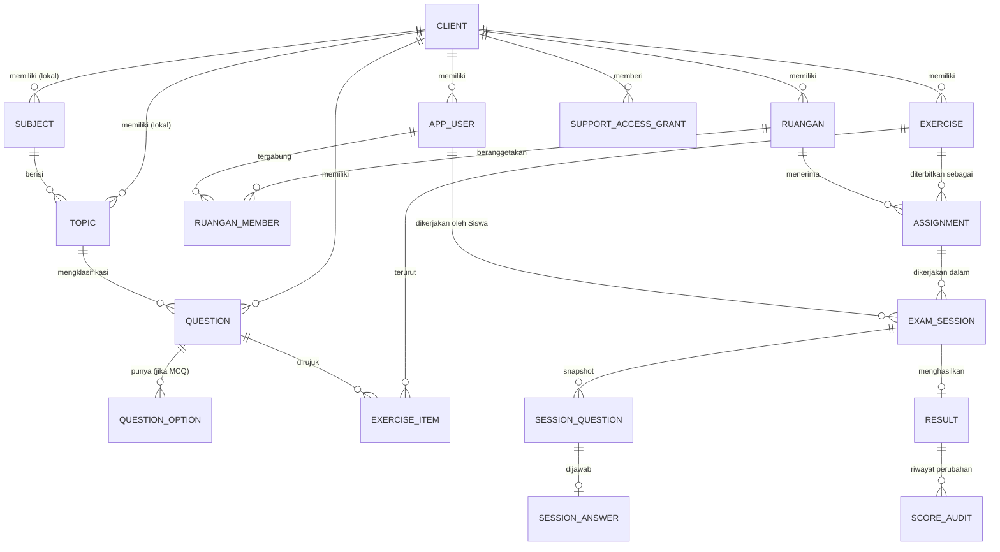
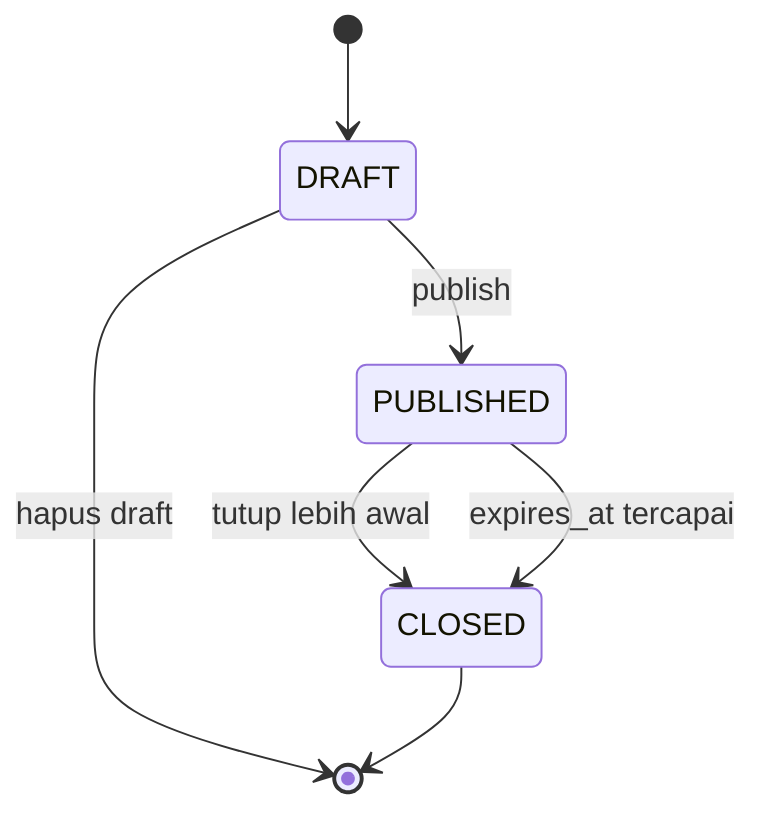
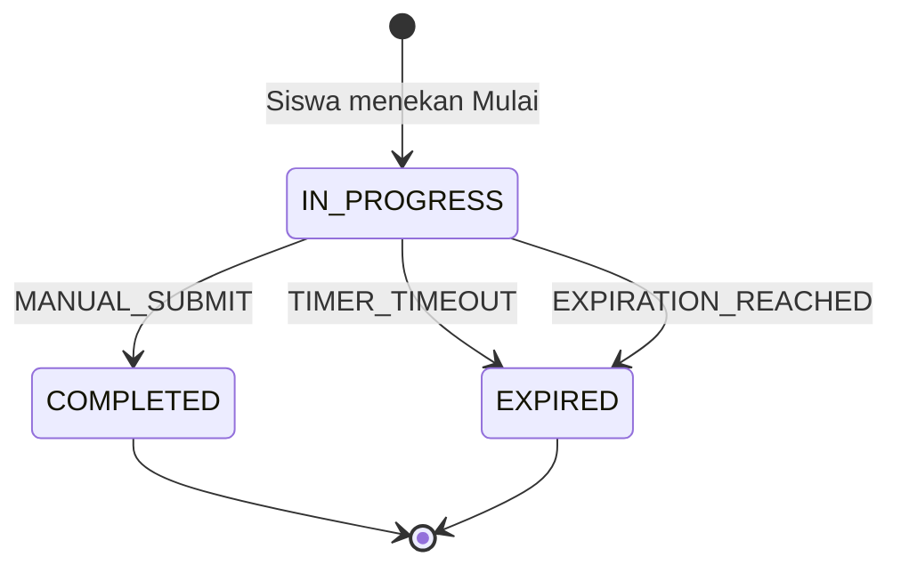
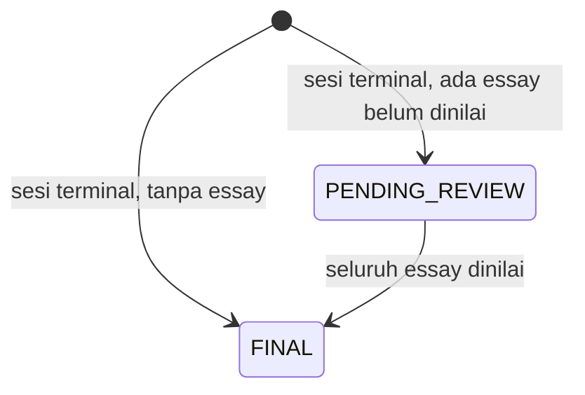

# Phase 1 Data Model: Portal Latihan Siswa Eduscreen (v1)

**Date**: 2026-08-31 | **Plan**: [plan.md](./plan.md) | **Spec**: [spec.md](./spec.md)

Kosakata mengikuti `CONTEXT.md`. Aturan perilaku yang dirujuk (`BR-*`) tinggal di
`business-rules.md`; aturan teknis (`TC-*`) di `CONSTITUTION.md`.

## Konvensi lintas tabel

| Konvensi | Aturan |
| --- | --- |
| Primary key | `UUID` v7, dibuat aplikasi sebelum persist (R-004, TC-08) |
| Tenant | Setiap tabel milik Client membawa `client_id NOT NULL`; disaring eksplisit di repository (TC-36) |
| Waktu | `timestamptz`, disimpan UTC, dikonversi ke zona Client hanya saat render (BR-T01, BR-T02) |
| Penghapusan | `deleted_at timestamptz NULL`, ditegakkan `@SQLRestriction` (TC-35, BR-Q04) |
| Audit dasar | `created_at`, `created_by`, `updated_at` pada tabel yang diedit manusia |
| Konten kaya | Kolom `*_html` berisi HTML tersanitasi + kolom `*_text` teks polos turunan (TC-22, TC-25) |

## Diagram



## Entitas

### `client`

Akar isolasi data.

| Kolom | Tipe | Aturan |
| --- | --- | --- |
| `id` | UUID v7 | PK |
| `name` | text | wajib |
| `timezone` | text | `Asia/Jakarta` \| `Asia/Makassar` \| `Asia/Jayapura` (FR-059) |
| `status` | enum | `ACTIVE` \| `SUSPENDED` |

### `app_user`

Satu tabel untuk semua peran. `client_id` null hanya untuk `EDUSCREEN_ADMIN`.

| Kolom | Tipe | Aturan |
| --- | --- | --- |
| `id` | UUID v7 | PK |
| `client_id` | UUID | null hanya untuk `EDUSCREEN_ADMIN` |
| `email` | citext | unik global, wajib (FR-007) |
| `full_name` | text | wajib |
| `role` | enum | `EDUSCREEN_ADMIN` \| `CLIENT_ADMIN` \| `GURU` \| `SISWA` |
| `status` | enum | `INVITED` \| `ACTIVE` \| `DEACTIVATED` |

- Kredensial **tidak** disimpan di sini; autentikasi lewat `IdentityProviderPort` (TC-06, TC-07).
- Menonaktifkan akun tidak menghapus riwayat pengerjaan (FR-011).

### `subject`

| Kolom | Tipe | Aturan |
| --- | --- | --- |
| `id` | UUID v7 | PK |
| `name` | text | memuat jenjang: `Matematika Kelas 4` (FR-012) |
| `origin` | enum | `GLOBAL` \| `CLIENT` (FR-013) |
| `client_id` | UUID | wajib bila `origin = CLIENT`, null bila `GLOBAL` |
| `deleted_at` | timestamptz | soft delete |

**Invariant**: `origin = GLOBAL` ⟺ `client_id IS NULL`. Ditegakkan check constraint.

### `topic`

| Kolom | Tipe | Aturan |
| --- | --- | --- |
| `id` | UUID v7 | PK |
| `subject_id` | UUID | induk |
| `name` | text | wajib |
| `origin` | enum | `GLOBAL` \| `CLIENT` |
| `client_id` | UUID | boleh berisi meski Subject induknya `GLOBAL` (FR-014) |
| `deleted_at` | timestamptz | soft delete |

### `question`

| Kolom | Tipe | Aturan |
| --- | --- | --- |
| `id` | UUID v7 | PK |
| `client_id` | UUID | null bila milik Eduscreen |
| `topic_id` | UUID | tepat satu Topic, wajib (FR-015) |
| `type` | enum | `MULTIPLE_CHOICE` \| `ESSAY` |
| `body_html` | text | HTML tersanitasi (TC-22) |
| `body_text` | text | teks polos turunan untuk pencarian (TC-25, FR-019) |
| `explanation_html` | text | pembahasan; wajib bila dipakai Practice (FR-029) |
| `source_question_id` | UUID | jejak adopsi, tanpa sinkronisasi (R-001) |
| `created_by` | UUID | pembuat |
| `deleted_at` | timestamptz | soft delete, tidak pernah hapus keras (FR-018) |

### `question_option`

| Kolom | Tipe | Aturan |
| --- | --- | --- |
| `id` | UUID v7 | PK |
| `question_id` | UUID | induk |
| `body_html`, `body_text` | text | sama seperti question |
| `is_correct` | boolean | tepat satu bernilai true per question (FR-016) |
| `position` | int | urutan asli sebelum pengacakan |

**Invariant**: question `MULTIPLE_CHOICE` punya ≥2 option dan tepat 1 `is_correct`. Divalidasi di
service; unique partial index menjaga tidak ada dua option benar.

### `exercise`

| Kolom | Tipe | Aturan |
| --- | --- | --- |
| `id` | UUID v7 | PK |
| `client_id` | UUID | null bila milik Eduscreen |
| `title` | text | wajib |
| `created_by` | UUID | pembuat |
| `locked_at` | timestamptz | terisi saat Assignment pertama dibuat (FR-026) |
| `deleted_at` | timestamptz | soft delete |

Tidak punya `subject_id` maupun `topic_id` — isinya boleh lintas Subject dan Topic (FR-024).

### `exercise_item`

| Kolom | Tipe | Aturan |
| --- | --- | --- |
| `exercise_id`, `question_id` | UUID | pasangan, unik |
| `position` | int | urutan yang disusun Guru |

### `ruangan`

| Kolom | Tipe | Aturan |
| --- | --- | --- |
| `id` | UUID v7 | PK |
| `client_id` | UUID | wajib |
| `name` | text | memuat periode: `Kelas 4B 2026/2027` |
| `status` | enum | `ACTIVE` \| `ARCHIVED` (FR-010) |

### `ruangan_member`

| Kolom | Tipe | Aturan |
| --- | --- | --- |
| `ruangan_id`, `user_id` | UUID | pasangan, unik |
| `member_role` | enum | `GURU` \| `SISWA` |

Many-to-many di kedua sisi: satu Siswa boleh di banyak Ruangan, satu Ruangan boleh punya banyak
Guru (FR-008).

### `assignment`

| Kolom | Tipe | Aturan |
| --- | --- | --- |
| `id` | UUID v7 | PK |
| `client_id` | UUID | wajib |
| `exercise_id` | UUID | isi soal |
| `ruangan_id` | UUID | tepat satu Ruangan (FR-027) |
| `published_by` | UUID | Guru penerbit |
| `mode` | enum | `QUIZ` \| `PRACTICE` (FR-028) |
| `status` | enum | `DRAFT` \| `PUBLISHED` \| `CLOSED` |
| `timer_duration_minutes` | int | wajib untuk `QUIZ`, boleh null untuk `PRACTICE` (FR-030) |
| `expires_at` | timestamptz | wajib kedua mode (FR-030) |
| `max_attempts` | int | ≥1 untuk `QUIZ`; diabaikan untuk `PRACTICE` (FR-054) |
| `shuffle_questions` | boolean | FR-031 |
| `shuffle_options` | boolean | FR-031 |
| `reveal_answers_at` | enum | `AFTER_SUBMIT` \| `AFTER_EXPIRATION`; hanya untuk `QUIZ` (FR-055) |
| `published_at` | timestamptz | |

### `exam_session`

| Kolom | Tipe | Aturan |
| --- | --- | --- |
| `id` | UUID v7 | PK |
| `client_id` | UUID | wajib, ikut ke setiap query (TC-36) |
| `assignment_id`, `student_id` | UUID | pasangan |
| `attempt_number` | int | 1,2,3… per pasangan; unik bersama pasangan itu |
| `status` | enum | `IN_PROGRESS` \| `COMPLETED` \| `EXPIRED` |
| `started_at` | timestamptz | waktu server saat Mulai ditekan |
| `effective_deadline` | timestamptz | **dibekukan** saat sesi lahir (FR-041) |
| `finalized_at` | timestamptz | |
| `terminal_reason` | enum | `MANUAL_SUBMIT` \| `TIMER_TIMEOUT` \| `EXPIRATION_REACHED` |

**Perhitungan `effective_deadline`** (FR-041, BR-T04):

```text
effective_deadline =
    timer_duration_minutes IS NOT NULL
        ? min(started_at + timer_duration_minutes, assignment.expires_at)
        : assignment.expires_at
```

Dihitung ulang **sekali** saat Guru memperpanjang `expires_at`, dan hanya untuk sesi yang masih
`IN_PROGRESS` (FR-043, BR-T06).

### `session_question`

Snapshot beku. Tidak pernah berubah setelah dibuat (FR-035).

| Kolom | Tipe | Aturan |
| --- | --- | --- |
| `id` | UUID v7 | PK |
| `session_id`, `question_id` | UUID | pasangan, unik |
| `position` | int | urutan hasil pengacakan untuk sesi ini |
| `option_order` | uuid[] | urutan Option hasil pengacakan untuk sesi ini |
| `locked_at` | timestamptz | terisi pada Practice saat jawaban dikirim (FR-038) |

### `session_answer`

| Kolom | Tipe | Aturan |
| --- | --- | --- |
| `id` | UUID v7 | PK |
| `session_question_id` | UUID | **unik** — kunci alami upsert (TC-20) |
| `selected_option_id` | UUID | untuk MCQ |
| `essay_text` | text | untuk essay |
| `is_correct` | boolean | dihitung untuk MCQ saat disimpan; null untuk essay |
| `essay_score` | int | 0–100, diisi Guru; null sampai dinilai (FR-050) |
| `answered_at` | timestamptz | waktu server |

Kolom biasa, bukan `JSONB` — bentuknya tetap (TC-16).

### `result`

| Kolom | Tipe | Aturan |
| --- | --- | --- |
| `id` | UUID v7 | PK |
| `session_id` | UUID | **unique constraint** (TC-19) |
| `client_id` | UUID | wajib |
| `status` | enum | `PENDING_REVIEW` \| `FINAL` |
| `kind` | enum | `GRADED` (Quiz) \| `PRACTICE` |
| `total_questions`, `correct_count`, `incorrect_count`, `unanswered_count` | int | rekap |
| `score` | numeric | disimpan sebagai hasil hitung, tidak dihitung ulang saat dibaca (TC-09 research) |

**Rumus** (FR-047, FR-050):

```text
poin(soal MCQ)   = is_correct ? 1 : 0
poin(soal essay) = essay_score / 100        -- null dianggap 0 selama PENDING_REVIEW
score            = Σ poin ÷ total_questions
```

### `score_audit`

Hanya-sisip. Tidak pernah diubah atau dihapus (FR-052, TC-37).

| Kolom | Tipe | Aturan |
| --- | --- | --- |
| `id` | UUID v7 | PK |
| `result_id` | UUID | |
| `session_answer_id` | UUID | null bila yang berubah adalah perhitungan ulang Result |
| `changed_by`, `changed_at` | UUID, timestamptz | |
| `old_value`, `new_value` | numeric | |

### `support_access_grant`

| Kolom | Tipe | Aturan |
| --- | --- | --- |
| `id` | UUID v7 | PK |
| `client_id` | UUID | pemberi izin |
| `granted_by`, `granted_at` | UUID, timestamptz | Client Admin |
| `expires_at` | timestamptz | `granted_at + 4 jam` (FR-006) |

Pembacaan selama jendela aktif dicatat di log audit terpisah yang bisa ditunjukkan ke Client.

## State Machine

### Assignment



| Transisi | Aturan |
| --- | --- |
| `DRAFT` → `PUBLISHED` | Mengunci Exercise (`locked_at`); memvalidasi Practice bebas essay (FR-026, FR-029) |
| `PUBLISHED` → `CLOSED` (manual) | Memfinalisasi seluruh sesi `IN_PROGRESS` di Assignment itu (FR-033) |
| `PUBLISHED` (edit) | Hanya `expires_at`, hanya diperpanjang (FR-032) |

### ExamSession



`COMPLETED` dan `EXPIRED` terminal. Tidak ada transisi keluar, termasuk saat `expires_at`
diperpanjang (FR-043).

**Algoritma finalisasi** (R-002, R-008, TC-18):

```text
finalizeIfExpired(sessionId):
  transaksi:
    session := SELECT ... FOR UPDATE WHERE id = sessionId AND client_id = :clientId
    jika session.status ≠ IN_PROGRESS       → kembalikan result yang ada (idempoten)
    jika now ≤ session.effective_deadline   → kembalikan apa adanya
    reason := effective_deadline == assignment.expires_at
                  ? EXPIRATION_REACHED : TIMER_TIMEOUT
    tulis status, terminal_reason, finalized_at
    hitung dan simpan Result   -- unique(session_id) sebagai jaring terakhir
```

### Result



Result `kind = PRACTICE` selalu langsung `FINAL` — Practice tidak pernah memuat essay (FR-029).

## Turunan yang tidak disimpan

| Nilai | Cara diperoleh |
| --- | --- |
| Status `NOT_STARTED` seorang Siswa | Anggota Ruangan yang tidak punya `exam_session` untuk Assignment itu. **Tidak** membuat baris sesi (FR-034, FR-056) |
| Nilai resmi pada Assignment | `MAX(result.score)` di antara seluruh sesi Siswa itu (FR-053) |
| Sisa waktu | `effective_deadline - now()` di server (FR-042) |

## Index yang diperlukan

| Tabel | Index | Untuk |
| --- | --- | --- |
| `exam_session` | `(assignment_id, student_id, attempt_number)` unik | batas pengulangan, cari sesi berjalan |
| `exam_session` | `(assignment_id, status)` | rekap dan finalisasi borongan |
| `session_answer` | `(session_question_id)` unik | kunci upsert auto-save |
| `session_question` | `(session_id, position)` | render berurutan |
| `result` | `(session_id)` unik | TC-19 |
| `question` | `(client_id, topic_id)` dan pencarian atas `body_text` | penelusuran bank soal |
| `ruangan_member` | `(user_id, member_role)` dan `(ruangan_id, member_role)` | portal Siswa, daftar anggota |
| `assignment` | `(ruangan_id, status, expires_at)` | daftar tugas aktif |
